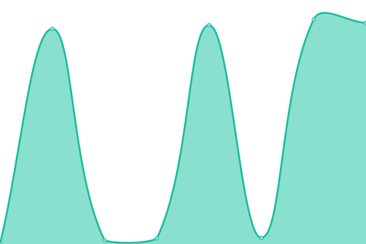

# [📈 Live Status](https://soemarko.github.io/statuspage): <!--live status--> **🟧 Partial outage**

This repository contains the open-source uptime monitor and status page for [soemarko](https://soemarko.github.io/statuspage), powered by [Upptime](https://github.com/upptime/upptime).

With [Upptime](https://upptime.js.org), you can get your own unlimited and free uptime monitor and status page, powered entirely by a GitHub repository. We use [Issues](https://github.com/soemarko/statuspage/issues) as incident reports, [Actions](https://github.com/soemarko/statuspage/actions) as uptime monitors, and [Pages](https://soemarko.github.io/statuspage) for the status page.

<!--start: status pages-->
<!-- This summary is generated by Upptime (https://github.com/upptime/upptime) -->
<!-- Do not edit this manually, your changes will be overwritten -->
<!-- prettier-ignore -->
| URL | Status | History | Response Time | Uptime |
| --- | ------ | ------- | ------------- | ------ |
|  [Home](https://lyrid.io) | 🟥 Down | [home.yml](https://github.com/soemarko/statuspage/commits/HEAD/history/home.yml) | 

 832ms
     
 | 

<a href="https://soemarko.github.io/statuspage/history/home">99.26%</a>
    

|  [API Server](https://api.lyrid.io/version) | 🟩 Up | [api-server.yml](https://github.com/soemarko/statuspage/commits/HEAD/history/api-server.yml) | 

 268ms
     
 | 

<a href="https://soemarko.github.io/statuspage/history/api-server">100.00%</a>
    

|  [Authentication Server](https://id.lyrid.io/version) | 🟩 Up | [authentication-server.yml](https://github.com/soemarko/statuspage/commits/HEAD/history/authentication-server.yml) | 

 241ms
     
 | 

<a href="https://soemarko.github.io/statuspage/history/authentication-server">99.28%</a>
    

|  [Yukbid URL Shortener](https://link.yukb.id/version) | 🟩 Up | [yukbid-url-shortener.yml](https://github.com/soemarko/statuspage/commits/HEAD/history/yukbid-url-shortener.yml) | 

 3470ms
     
 | 

<a href="https://soemarko.github.io/statuspage/history/yukbid-url-shortener">99.30%</a>
    

|  [Yukbid Staging](https://yukbid.lyr.id/homepage) | 🟩 Up | [yukbid-staging.yml](https://github.com/soemarko/statuspage/commits/HEAD/history/yukbid-staging.yml) | 

 14836ms
     
 | 

<a href="https://soemarko.github.io/statuspage/history/yukbid-staging">100.00%</a>
    

<!--end: status pages-->

[**Visit our status website →**](https://soemarko.github.io/statuspage)

## 📄 License

- Powered by: [Upptime](https://github.com/upptime/upptime)
- Code: [MIT](./LICENSE) © [soemarko](https://soemarko.github.io/statuspage)
- Data in the `./history` directory: [Open Database License](https://opendatacommons.org/licenses/odbl/1-0/)
